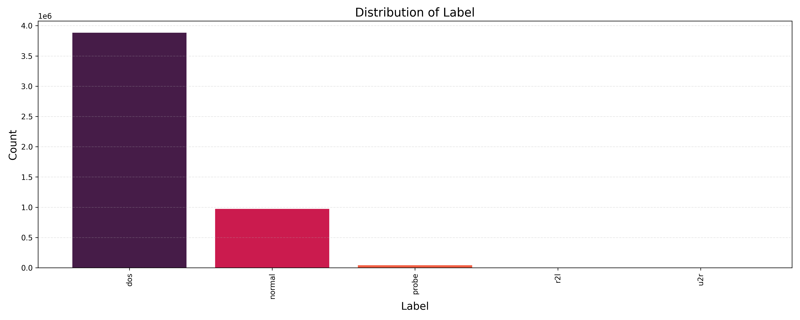
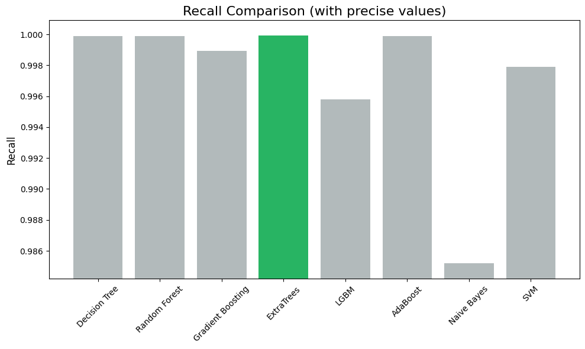
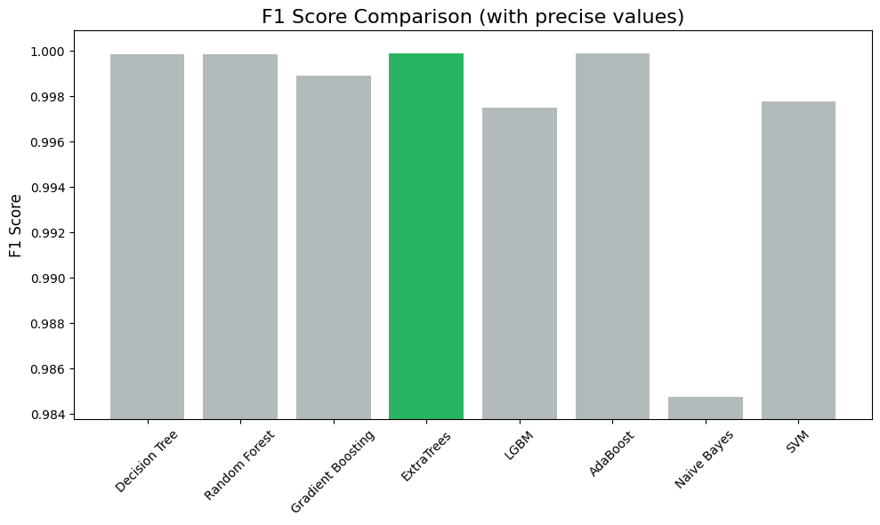

# Machine learning / KDD CUP 1999

**<p align="center">INTRUSION DETECTOR</p>**

<p align="center">


</p>

</br>

### 1- مجموعه داده

<p align="justify">از سال ۱۹۹۹، مجموعه داده KDD CUP 1999 به‌عنوان پرکاربردترین مجموعه داده برای ارزیابی روش‌های تشخیص ناهنجاری مورد استفاده قرار گرفته است. این مجموعه توسط استولفو و همکارانش بر پایه سیستم‌های تشخیص نفوذ (IDS) در آژانس تحقیق و توسعه وزارت دفاع ایالات متحده ساخته شده است. مجموعه داده KDD شامل ۴,۸۹۸,۴۳۱ رکورد Single Connection است که هر یک شامل ۴۲ ویژگی مختلف هستند و به‌عنوان رفتارهای عادی یا حملات برچسب‌گذاری شده‌اند. مجموعه داده KDD شامل ویژگی‌های متنوعی است که هر کدام اطلاعات خاصی را در مورد اتصالات شبکه ارائه می‌دهند. ویژگی duration نشان‌دهنده مدت زمان اتصال در ثانیه است. protocol_type نوع پروتکل شبکه را مشخص می‌کند، مانند TCP، UDP و ICMP. ویژگی service نوع سرویسی را که روی مقصد اجرا می‌شود، مانند http، ftp و smtp، توصیف می‌کند. flag وضعیت اتصال را نشان می‌دهد و src_bytes تعداد بایت‌هایی که از مبدأ به مقصد ارسال شده‌اند را مشخص می‌کند. ویژگی dst_bytes تعداد بایت‌هایی که از مقصد به مبدأ ارسال شده‌اند را بیان می‌کند. land نشان می‌دهد که آیا مبدأ و مقصد اتصال یکسان هستند. wrong_fragment تعداد تکه‌های شکسته در اتصال و urgent تعداد بسته‌های نشان‌دهنده پیام‌های اضطراری را توصیف می‌کند. hot تعداد فعالیت‌های مشکوک در اتصال را شامل می‌شود، مانند ورود به دایرکتوری‌های خاص یا استفاده از دستورات حساس. num_failed_logins تعداد تلاش‌های ناموفق برای ورود و logged_in موفقیت یا عدم موفقیت در ورود به سیستم را نشان می‌دهد. ویژگی num_compromised تعداد فیلدهای حساس آسیب‌دیده در حمله را مشخص می‌کند. root_shell نشان می‌دهد که آیا شل روت دسترسی پیدا کرده است یا خیر و su_attempted تعداد تلاش‌ها برای استفاده از دستور su را بیان می‌کند. num_root تعداد دستورات اجرا شده به عنوان کاربر روت و num_file_creations تعداد فایل‌های ایجاد شده در سیستم را مشخص می‌کند. num_shells تعداد شل‌های باز شده در اتصال را نشان می‌دهد و num_access_files تعداد دفعات دسترسی به فایل‌های حساس را بیان می‌کند. ویژگی num_outbound_cmds تعداد فرمان‌های ارسال شده به خارج از سیستم است. is_host_login و is_guest_login به ترتیب نشان می‌دهند که آیا ورود به سیستم به عنوان کاربر میزبان یا مهمان انجام شده است. count تعداد اتصالات به همان میزبان در بازه زمانی دو ثانیه و srv_count تعداد اتصالات به همان سرویس در همان بازه زمانی را مشخص می‌کند. ویژگی‌های serror_rate، srv_serror_rate، rerror_rate و srv_rerror_rate درصد اتصالات با خطاهای SYN و REJ را در بازه‌های زمانی مشخص نشان می‌دهند. same_srv_rate و diff_srv_rate به ترتیب درصد اتصالات به همان سرویس و به سرویس‌های مختلف در بازه زمانی دو ثانیه را توصیف می‌کنند. ویژگی srv_diff_host_rate درصد اتصالات به میزبان‌های مختلف به همان سرویس را نشان می‌دهد. dst_host_count و dst_host_srv_count به ترتیب تعداد اتصالات به میزبان مقصد و تعداد اتصالات به همان سرویس در میزبان مقصد را بیان می‌کنند. ویژگی‌های dst_host_same_srv_rate و dst_host_diff_srv_rate درصد اتصالات به همان سرویس و به سرویس‌های مختلف در میزبان مقصد را توصیف می‌کنند. dst_host_same_src_port_rate درصد اتصالات به همان پورت مبدأ در میزبان مقصد را مشخص می‌کند و dst_host_srv_diff_host_rate درصد اتصالات به میزبان‌های مختلف به همان سرویس در میزبان مقصد را نشان می‌دهد. در نهایت، ویژگی‌های dst_host_serror_rate، dst_host_srv_serror_rate، dst_host_rerror_rate و dst_host_srv_rerror_rate درصد اتصالات به میزبان مقصد که با خطاهای SYN و REJ مواجه شده‌اند را مشخص می‌کنند. ویژگی label نوع برچسب یا کلاس حمله را نشان می‌دهد که می‌تواند Normal یا نوع خاصی از حمله باشد. نکته قابل توجه این است که در این مجموعه داده، مقادیر null وجود ندارد.</p>

</br>

### 1˗1- مشخصات مجموعه داده

<p align="justify">جدول 1-1-1 به تفصیل به ویژگی‌های مختلف موجود در مجموعه داده KDD CUP 1999 پرداخته و اطلاعات کلیدی هر ویژگی را ارائه می‌دهد.</p>

| ردیف | ویژگی                       | توصیف                                                                                      |
| ---- | --------------------------- | ------------------------------------------------------------------------------------------ |
| 1    | duration                    | مدت زمان اتصال در ثانیه.                                                                   |
| 2    | protocol_type               | نوع پروتکل شبکه، مانند TCP, UDP, ICMP.                                                     |
| 3    | service                     | نوع سرویسی که روی مقصد اجرا می‌شود (مثل http, ftp, smtp).                                  |
| 4    | flag                        | وضعیت اتصال                                                                                |
| 5    | src_bytes                   | تعداد بایت‌هایی که از سمت مبدأ به مقصد ارسال شده‌اند.                                      |
| 6    | dst_bytes                   | تعداد بایت‌هایی که از سمت مقصد به مبدأ ارسال شده‌اند.                                      |
| 7    | land                        | نشان‌دهنده این است که آیا مبدأ و مقصد اتصال یکسان هستند یا خیر (1: بله، 0: خیر).           |
| 8    | wrong_fragment              | تعداد fragment در اتصال.                                                                   |
| 9    | urgent                      | تعداد بسته‌های نشان‌دهنده‌ی پیام‌های اضطراری.                                              |
| 10   | hot                         | تعداد فعالیت‌های مشکوک در اتصال، مثل ورود به دایرکتوری‌های خاص یا استفاده از دستورات حساس. |
| 11   | num_failed_logins           | تعداد تلاش‌های ناموفق برای ورود                                                            |
| 12   | logged_in                   | نشان‌دهنده موفقیت یا عدم موفقیت در ورود به سیستم (1: ورود موفق، 0: ناموفق).                |
| 13   | num_compromised             | تعداد فیلدهای حساس در سیستم که در حمله آسیب دیده‌اند.                                      |
| 14   | root_shell                  | نشان‌دهنده این است که آیا شل روت دسترسی پیدا کرده است یا خیر (1: بله، 0: خیر).             |
| 15   | su_attempted                | تعداد تلاش‌ها برای استفاده از دستور su (برای دسترسی به کاربر روت).                         |
| 16   | num_root                    | تعداد دستورات اجرا شده به عنوان کاربر روت.                                                 |
| 17   | num_file_creations          | تعداد فایل‌هایی که در سیستم ایجاد شده‌اند.                                                 |
| 18   | num_shells                  | تعداد شل‌های باز شده در اتصال.                                                             |
| 19   | num_access_files            | تعداد دفعاتی که به فایل‌های حساس دسترسی پیدا شده است.                                      |
| 20   | num_outbound_cmds           | تعداد فرمان‌های ارسال شده به خارج از سیستم (فقط در پروتکل FTP).                            |
| 21   | is_host_login               | آیا ورود به سیستم به عنوان کاربر میزبان انجام شده است یا خیر (1: بله، 0: خیر).             |
| 22   | is_guest_login              | آیا ورود به سیستم به عنوان کاربر مهمان انجام شده است یا خیر (1: بله، 0: خیر).              |
| 23   | count                       | تعداد اتصالات به همان میزبان در بازه زمانی دو ثانیه.                                       |
| 24   | srv_count                   | تعداد اتصالات به همان سرویس در بازه زمانی دو ثانیه.                                        |
| 25   | serror_rate                 | درصد اتصالات با خطای SYN در بازه زمانی دو ثانیه.                                           |
| 26   | srv_serror_rate             | درصد اتصالات به همان سرویس با خطای SYN در بازه زمانی دو ثانیه.                             |
| 27   | rerror_rate                 | درصد اتصالات با خطای REJ در بازه زمانی دو ثانیه.                                           |
| 28   | srv_rerror_rate             | درصد اتصالات به همان سرویس با خطای REJ در بازه زمانی دو ثانیه.                             |
| 29   | same_srv_rate               | درصد اتصالات به همان سرویس در بازه زمانی دو ثانیه.                                         |
| 30   | diff_srv_rate               | درصد اتصالات به سرویس‌های مختلف در بازه زمانی دو ثانیه.                                    |
| 31   | srv_diff_host_rate          | درصد اتصالات به میزبان‌های مختلف به همان سرویس.                                            |
| 32   | dst_host_count              | تعداد اتصالات به میزبان مقصد در بازه زمانی دو ثانیه.                                       |
| 33   | dst_host_srv_count          | تعداد اتصالات به همان سرویس در میزبان مقصد.                                                |
| 34   | dst_host_same_srv_rate      | درصد اتصالات به همان سرویس در میزبان مقصد.                                                 |
| 35   | dst_host_diff_srv_rate      | درصد اتصالات به سرویس‌های مختلف در میزبان مقصد.                                            |
| 36   | dst_host_same_src_port_rate | درصد اتصالات به همان پورت مبدأ در میزبان مقصد.                                             |
| 37   | dst_host_srv_diff_host_rate | درصد اتصالات به میزبان‌های مختلف به همان سرویس در میزبان مقصد.                             |
| 38   | dst_host_serror_rate        | درصد اتصالات به میزبان مقصد که خطای SYN داشته‌اند.                                         |
| 39   | dst_host_srv_serror_rate    | درصد اتصالات به همان سرویس در میزبان مقصد که خطای SYN داشته‌اند.                           |
| 40   | dst_host_rerror_rate        | درصد اتصالات به میزبان مقصد که خطای REJ داشته‌اند.                                         |
| 41   | dst_host_srv_rerror_rate    | درصد اتصالات به همان سرویس در میزبان مقصد که خطای REJ داشته‌اند.                           |
| 42   | label                       | نوع برچسب (یا کلاس) حمله: normal یا نوع خاصی از حمله.                                      |

</br>

### 1˗2- نمونه هایی از مجموعه داده

<p align="justify">جدول 1-2-1 به‌عنوان نمایش اولیه‌ای از مجموعه داده KDD CUP 1999، شش ردیف مختلف را قبل از هرگونه پردازش نشان می‌دهد. به علت زیاد بودن تعداد ویژگی‌ها بخشی از ویژگی در جدول قرار داده نشده است.</p>

| ویژگی 1 | ویژگی 2 | ویژگی 3 | ویژگی 4 | ویژگی 5 | ویژگی 6 | ویژگی 7 | ... | ویژگی 36 | ویژگی 37 | ویژگی 38 | ویژگی 39 | ویژگی 40 | ویژگی 41 | ویژگی 42 |
| ------- | ------- | ------- | ------- | ------- | ------- | ------- | --- | -------- | -------- | -------- | -------- | -------- | -------- | -------- |
| 0       | tcp     | http    | SF      | 215     | 45076   | 0       | ... | 0        | 0        | 0        | 0        | 0        | 0        | normal   |
| 0       | tcp     | http    | SF      | 162     | 4528    | 0       | ... | 1        | 0        | 0        | 0        | 0        | 0        | normal   |
| 0       | tcp     | http    | SF      | 236     | 1228    | 0       | ... | 0/5      | 0        | 0        | 0        | 0        | 0        | normal   |
| 0       | tcp     | http    | SF      | 233     | 2032    | 0       | ... | 0/33     | 0        | 0        | 0        | 0        | 0        | normal   |
| 0       | tcp     | http    | SF      | 239     | 486     | 0       | ... | 0/25     | 0        | 0        | 0        | 0        | 0        | normal   |
| 0       | tcp     | http    | SF      | 238     | 1282    | 0       | ... | 0/2      | 0        | 0        | 0        | 0        | 0        | normal   |

</br>

### 1˗3- مشخصات اولیه ویژگی های مجموعه داده

<p align="justify">جدول 1-3-1 مشخصات اولیه ویژگی‌های موجود در مجموعه داده KDD 99 را به‌تفصیل نشان می‌دهد و اطلاعات کلیدی در مورد تعداد رکوردها، حداکثر و حداقل مقادیر، مقدار میانه و تعداد داده‌های ناموجود برای هر ویژگی را ارائه می‌دهد.</p>

| ویژگی                       | تعداد   | ماکزیمم مقدار                                                                     | مینیمم مقدار | مقدار میانه | تعداد داده‌های ناموجود |
| --------------------------- | ------- | --------------------------------------------------------------------------------- | ------------ | ----------- | ---------------------- |
| duration                    | 4898431 | 58329                                                                             | 0            | 0           | 0                      |
| src_bytes                   | 4898431 | 1379963888                                                                        | 0            | 520         | 0                      |
| dst_bytes                   | 4898431 | 1309937401                                                                        | 0            | 0           | 0                      |
| land                        | 4898431 | 1                                                                                 | 0            | 0           | 0                      |
| wrong_fragment              | 4898431 | 3                                                                                 | 0            | 0           | 0                      |
| urgent                      | 4898431 | 14                                                                                | 0            | 0           | 0                      |
| hot                         | 4898431 | 77                                                                                | 0            | 0           | 0                      |
| num_failed_logins           | 4898431 | 5                                                                                 | 0            | 0           | 0                      |
| logged_in                   | 4898431 | 1                                                                                 | 0            | 0           | 0                      |
| num_compromised             | 4898431 | 7479                                                                              | 0            | 0           | 0                      |
| root_shell                  | 4898431 | 1                                                                                 | 0            | 0           | 0                      |
| su_attempted                | 4898431 | 2                                                                                 | 0            | 0           | 0                      |
| num_root                    | 4898431 | 7468                                                                              | 0            | 0           | 0                      |
| num_file_creations          | 4898431 | 43                                                                                | 0            | 0           | 0                      |
| num_shells                  | 4898431 | 2                                                                                 | 0            | 0           | 0                      |
| num_access_files            | 4898431 | 9                                                                                 | 0            | 0           | 0                      |
| num_outbound_cmds           | 4898431 | 0                                                                                 | 0            | 0           | 0                      |
| is_host_login               | 4898431 | 1                                                                                 | 0            | 0           | 0                      |
| is_guest_login              | 4898431 | 1                                                                                 | 0            | 0           | 0                      |
| count                       | 4898431 | 511                                                                               | 0            | 510         | 0                      |
| srv_count                   | 4898431 | 511                                                                               | 0            | 510         | 0                      |
| serror_rate                 | 4898431 | 1                                                                                 | 0            | 0           | 0                      |
| srv_serror_rate             | 4898431 | 1                                                                                 | 0            | 0           | 0                      |
| rerror_rate                 | 4898431 | 1                                                                                 | 0            | 0           | 0                      |
| srv_rerror_rate             | 4898431 | 1                                                                                 | 0            | 0           | 0                      |
| same_srv_rate               | 4898431 | 1                                                                                 | 0            | 1           | 0                      |
| diff_srv_rate               | 4898431 | 1                                                                                 | 0            | 0           | 0                      |
| srv_diff_host_rate          | 4898431 | 1                                                                                 | 0            | 0           | 0                      |
| dst_host_count              | 4898431 | 255                                                                               | 0            | 255         | 0                      |
| dst_host_srv_count          | 4898431 | 255                                                                               | 0            | 255         | 0                      |
| dst_host_same_srv_rate      | 4898431 | 1                                                                                 | 0            | 1           | 0                      |
| dst_host_diff_srv_rate      | 4898431 | 1                                                                                 | 0            | 0           | 0                      |
| dst_host_same_src_port_rate | 4898431 | 1                                                                                 | 0            | 1           | 0                      |
| dst_host_srv_diff_host_rate | 4898431 | 1                                                                                 | 0            | 0           | 0                      |
| dst_host_serror_rate        | 4898431 | 1                                                                                 | 0            | 0           | 0                      |
| dst_host_srv_serror_rate    | 4898431 | 1                                                                                 | 0            | 0           | 0                      |
| dst_host_rerror_rate        | 4898431 | 1                                                                                 | 0            | 0           | 0                      |
| dst_host_srv_rerror_rate    | 4898431 | 1                                                                                 | 0            | 0           | 0                      |
| protocol_type               | 4898431 | 2833545 (icmp), 1870598 (tcp), 194288 (udp)                                       | 0            | 0           | 0                      |
| service                     | 4898431 | ecr_i (2811660), private (1100831), http (623091), smtp (96554), domain_u (57782) | 0            | 0           | 0                      |
| flag                        | 4898431 | SF (3744328), S0 (869829), REJ (268874), RSTR (8094)                              | 0            | 0           | 0                      |
| Label                       | 4898431 | dos (3883370), normal (972781), probe (41102), R2l (1126), U2r (52)               | 0            | 0           | 0                      |

### 1˗4- نمودارهای توصیف داده

<p align="justify">در این بخش، نمودارهایی قرار گرفته‌اند که به توصیف و تفسیر دقیق‌تر داده‌ها کمک می‌کنند و تصویری کلی از الگوهای موجود در داده‌ها را ارائه می‌دهند. 
نمودار مربوط به ویژگی protocol_type توزیع تعداد انواع مختلف پروتکل‌ها را در بین داده‌های ثبت شده نشان می‌دهد. در مجموعه داده‌ی مورد بررسی، تعداد کل مقادیر برابر با 4,898,431 است که این مقدار بیانگر تعداد کل رکوردها یا مشاهده‌ها در این داده‌ها می‌باشد. ویژگی protocol_type شامل سه نوع پروتکل منحصر به فرد است که به ترتیب icmp، tcp و udp هستند. بیشترین تعداد مربوط به پروتکل icmp است که با 2,833,545 مشاهده، سهم قابل توجهی از کل رکوردها را تشکیل می‌دهد. پس از آن پروتکل tcp با 1,870,598 مشاهده قرار دارد که نشان می‌دهد این پروتکل نیز سهم بزرگی در داده‌ها دارد، اما نسبت به icmp کمتر است. پروتکل udp نیز با 194,288 مشاهده، کمترین تعداد را در میان پروتکل‌های ذکر شده داراست. این توزیع بیانگر این است که پروتکل‌های icmp و tcp به مراتب بیشتر از udp در این مجموعه داده تکرار شده‌اند و غالب ارتباطات یا ترافیک‌های موجود را تشکیل می‌دهند. با توجه به این اعداد و نمودار ارائه شده، می‌توان نتیجه گرفت که icmp و tcp دو پروتکل غالب در این مجموعه داده هستند. شکل زیر نمای کلی این توزیع را به وضوح نمایش می‌دهد (شکل 1-4-1).</p>

<p align="center"></p>

<p align="justify">در مجموعه داده KDD 99، ویژگی service توزیع سرویس‌های مختلف در شبکه را به تفصیل نمایش می‌دهد که شامل 4,898,431 رکورد است که هر یک نوعی از سرویس شبکه را نشان می‌دهد. در این توزیع، سرویس ecr_i با 2,811,660 مورد، بیشترین تکرار را دارد و بخش قابل توجهی از کل داده‌ها را تشکیل می‌دهد؛ این امر نشان‌دهنده استفاده گسترده از این سرویس در ارتباطات شبکه در این مجموعه داده است. پس از آن، سرویس private با 1,100,831 مشاهده در رتبه دوم قرار دارد که خود بیانگر نقش مهم این سرویس در شبکه است. همچنین، سرویس http با 623,091 مورد در جایگاه سوم قرار گرفته و اهمیت آن در انتقال داده‌های وب و اینترنت را به خوبی نشان می‌دهد. سایر سرویس‌ها مانند smtp و other به ترتیب با 96,554 و 72,653 مشاهده در جایگاه‌های بعدی قرار دارند، که از حضور قابل توجه اما کم‌تر آن‌ها در این مجموعه داده حکایت می‌کند.
تعداد قابل توجهی از سرویس‌ها مانند domain_u، ftp_data و eco_i نیز در مقادیر کمتری مشاهده می‌شوند اما همچنان در شبکه حضور دارند. در این میان، سرویس‌هایی مانند urh_i، X11 و tim_i هرکدام کمتر از 150 مشاهده داشته‌اند، که نشان می‌دهد کاربرد این سرویس‌ها محدودتر است. در نهایت، سرویس‌های بسیار نادر مانند http_2784، harvest و aol تنها در چند رکورد مشاهده شده‌اند. شکل زیر نمای کلی این توزیع را به وضوح نمایش می‌دهد (شکل 1-4-2).</p>

<p align="center"></p>

<p align="justify">در مجموعه داده KDD 99، ویژگی flag توزیع وضعیت‌های مختلف اتصال در شبکه را نشان می‌دهد که بیانگر حالت‌های متنوع بسته‌های ارتباطی در هنگام برقراری و پایان یک جلسه ارتباطی است. این ویژگی شامل 4,898,431 رکورد است و هر یک از مقادیر آن وضعیت خاصی را در جریان ارتباطات شبکه توصیف می‌کند. در این توزیع، وضعیت SF با 3,744,328 مشاهده، بیشترین سهم را داراست و به این معناست که در بیشتر اتصالات، بسته‌ها بدون مشکل تحویل داده شده‌اند و برقراری و پایان جلسه موفقیت‌آمیز بوده است. پس از آن، وضعیت S0 با 869,829 مشاهده در رتبه دوم قرار دارد که نشان می‌دهد بسیاری از اتصالات آغاز شده‌اند ولی بدون دریافت پاسخ از سمت مقصد، نیمه‌کاره مانده‌اند.
در رتبه سوم، وضعیت REJ با 268,874 مشاهده قرار دارد که نشان‌دهنده اتصالاتی است که به دلیل رد شدن توسط مقصد، به پایان نرسیده‌اند. وضعیت‌های RSTR و RSTO با 8,094 و 5,344 مشاهده نیز جزو وضعیت‌هایی هستند که نشان‌دهنده اتصال‌هایی‌اند که به‌طور ناگهانی توسط مقصد قطع شده‌اند یا در میانه ارتباط به مشکل برخورده‌اند. از سوی دیگر، وضعیت‌هایی مانند SH، S1 و S2 که به ترتیب 1,040، 532 و 161 بار مشاهده شده‌اند، بیانگر شرایط خاص‌تری هستند و کمتر در شبکه رخ داده‌اند. در نهایت، وضعیت‌های بسیار نادری همچون RSTOS0، OTH و S3 با تعداد مشاهدات کمتر از 150 بار دیده شده‌اند که نشان‌دهنده شرایط بسیار خاص و نادر در این مجموعه داده است (شکل 1-4-3).</p>

<p align="center"></p>

<p align="justify">ویژگی Label در مجموعه داده KDD 99 به توزیع انواع حملات و وضعیت‌های ترافیکی در شبکه اشاره دارد و شامل 4,898,431 رکورد است که هر یک نوع خاصی از فعالیت‌های شبکه را توصیف می‌کند. در این توزیع، حملاتDOS  با 3,883,370 مشاهده، سهم غالبی را به خود اختصاص داده‌اند و به وضوح نشان‌دهنده این است که بخش عمده‌ای از ترافیک شبکه مربوط به حملات تخریبی و عدم دسترسی به خدمات است. در مقام دوم، وضعیت normal با 972,781 مشاهده قرار دارد که به اتصالات عادی و بدون حمله اشاره دارد و این امر نشان‌دهنده اهمیت ارزیابی ترافیک سالم در میان انواع حملات است.
سپس، نوع حمله probe با 41,102 مشاهده به‌عنوان فعالیت‌هایی شناخته می‌شود که شامل تلاش برای شناسایی آسیب‌پذیری‌های سیستم‌ها می‌شود و در نتیجه، مقادیر کمتری را نسبت به حملات DOS و ترافیک عادی به خود اختصاص داده است. دو نوع دیگر حملات، یعنی r2l و u2r، به ترتیب با 1,126 و 52 مشاهده، در جایگاه‌های بعدی قرار دارند. این دو نوع حمله به فعالیت‌هایی اشاره دارند که در آن‌ها یک مهاجم تلاش می‌کند تا به سیستم‌های محلی دسترسی پیدا کند یا از دسترسی‌های محلی برای افزایش سطح دسترسی خود استفاده کند، که به‌وضوح کمتر رایج هستند (شکل 1-4-4).</p>

<p align="center"></p>
<p align="center"></p>

</br>

### 2- پیش‌پردازش داده‌ها

<p align="justify">پیش‌پردازش داده‌ها فرآیندی چندمرحله‌ای و دقیق است که داده‌های خام را برای استفاده در تحلیل‌ها و مدل‌های یادگیری ماشین آماده‌سازی می‌کند (شکل 2-1). این فرآیند با گام‌های اولیه‌ای مانند شناسایی و حذف ویژگی‌های غیرضروری آغاز می‌شود (شکل 2-2). ابتدا، برای شناخت دقیق‌تر ساختار داده‌ها و روابط میان آن‌ها، تحلیل همبستگی انجام می‌شود که در کد این مرحله از متد chm استفاده شده است. این متد با رسم Correlation Heatmap ارتباطات میان ویژگی‌های عددی مختلف را مشخص می‌کند (شکل 2-3). این نقشه با ارائه‌ی روابط عددی میان متغیرها، شناسایی ویژگی‌هایی که ممکن است اطلاعات مشابهی را به مدل اضافه کنند، ممکن می‌سازد. به‌عبارت‌دیگر، برخی از ویژگی‌ها ممکن است به‌شدت با یکدیگر همبستگی داشته باشند که در این صورت می‌توانند حذف یا ترکیب شوند تا از پیچیدگی و افزونگی مدل جلوگیری شود. پس از شناسایی این ویژگی‌های اضافی و غیرضروری، در مرحله بعد ویژگی‌هایی که با دیگران همبستگی بالایی دارند و احتمالا باعث پیچیدگی بیشتر مدل می‌شوند، از مجموعه داده حذف می‌شوند؛ این گام در نهایت به کاهش ابعاد داده و بهبود کارایی مدل منجر خواهد شد.</p>

<p align="justify">گام بعدی به تحلیل توزیع ویژگی‌های مختلف داده اختصاص دارد که در کد از طریق متد phg و psh انجام می‌شود. این توابع نمودارهای توزیع و نمودارهای میله‌ای ویژگی‌های اصلی را ترسیم می‌کنند، که به ما کمک می‌کند تا توزیع هر ویژگی را مشاهده کنیم. نمودارهای توزیع، به تحلیل نحوه‌ی پخش داده‌ها در هر ویژگی کمک کرده و دیدگاهی روشن از پراکندگی داده‌ها فراهم می‌کنند. این گام به شناسایی نقاط پرت، داده‌های نامتعادل یا ناهماهنگی‌ها در توزیع داده‌ها کمک می‌کند که ممکن است در کیفیت آموزش مدل تأثیرگذار باشند.
در ادامه، ویژگی‌های دسته‌بندی‌شده (مانند نوع پروتکل، سرویس و وضعیت اتصال) که در قالب داده‌های متنی هستند، باید به صورت عددی کدگذاری شوند تا مدل‌های یادگیری ماشین بتوانند از آن‌ها استفاده کنند؛ این کار با استفاده از LabelEncoder در متد ppd صورت می‌گیرد. کدگذاری این ویژگی‌ها به مدل اجازه می‌دهد تا به جای داده‌های متنی، مقادیر عددی را به عنوان ورودی دریافت کند، که نه‌تنها کارآمدتر است بلکه امکان انجام محاسبات پیچیده‌تر را نیز فراهم می‌کند. پس از کدگذاری، مرحله نرمال‌سازی انجام می‌شود. در این مرحله، ویژگی‌هایی که دارای مقادیر مختلفی در بازه‌های متفاوت هستند، با استفاده از مقیاس‌بندی MinMaxScaler به یک بازه استاندارد تبدیل می‌شوند. شکل 2-3 کد MinMaxScaler را نمایش می‌دهد. این نرمال‌سازی در متد ppd به مدل کمک می‌کند تا از تفاوت‌های بزرگ عددی میان ویژگی‌ها جلوگیری شود و الگوریتم به دلیل مقادیر بزرگ یا کوچک، به اشتباه اولویت‌بندی نکند. شکل 2-4 توزیع ویژگی‌های نرمال شده را نمایش می‌دهد.</p>

<p align="center"></p>

<p align="justify">سپس، اطلاعات آماری هر ویژگی در این مرحله جمع‌آوری و ذخیره می‌شود. این کار شامل محاسبه و ذخیره‌ی مواردی مانند تعداد مقادیر، کمینه، بیشینه و میانه برای هر ویژگی عددی است که در کد از طریق متد numeric_features انجام می‌شود. این اطلاعات آماری در تحلیل داده‌ها بسیار مفید هستند و به بررسی دقیق‌تر کیفیت و ویژگی‌های خاص هر متغیر کمک می‌کنند.
در پایان، توزیع مقادیر برای ویژگی‌های دسته‌بندی شده نیز جمع‌آوری می‌شود که از طریق متد categorical_features انجام می‌شود. این متد، تعداد وقوع هر مقدار را در ویژگی‌های دسته‌بندی‌شده محاسبه و ذخیره می‌کند. این مرحله به ما کمک می‌کند تا میزان تکرار و توزیع هر مقدار را بهتر بشناسیم و به‌ویژه در شناخت عدم‌توازن داده‌ها که ممکن است نیاز به تعدیل داشته باشند، اهمیت دارد (شکل 2-4).</p>

<p align="justify">این مجموعه‌ی کامل از فرآیندهای پیش‌پردازش باعث می‌شود داده‌ها برای ورود به مدل‌های یادگیری ماشین آماده، تمیز و بهینه شوند. هر مرحله از این فرآیند نه‌تنها کیفیت داده‌ها را بهبود می‌بخشد، بلکه با کاهش نویز و ساده‌سازی داده‌ها، موجب می‌شود مدل‌های یادگیری ماشین بتوانند به شکل موثرتری از اطلاعات موجود بهره ببرند و دقت و کارایی بالاتری در پیش‌بینی‌ها ارائه دهند.</p>

</br>

### 3- اجرای الگوریتم‌ها بر روی مجموعه داده

<p align="justify">درخت‌های تصمیم یکی از روش‌های محبوب و قدرتمند در یادگیری ماشین و به‌ویژه در مسائل طبقه‌بندی و رگرسیون هستند. این مدل‌ها به صورت سلسله‌مراتبی کار می‌کنند و داده‌ها را به‌گونه‌ای ساختاریافته از طریق یک سری از تصمیم‌ها و تقسیم‌بندی‌ها تفکیک می‌کنند. هر تصمیم یا گره در درخت بر اساس ویژگی‌های مختلف داده، یک سؤال «بله یا خیر» می‌پرسد، و این فرآیند به تقسیم‌بندی داده به شاخه‌های جدید منجر می‌شود. ساختار درخت‌های تصمیم به‌گونه‌ای است که از یک گره ریشه شروع شده و به مرور به گره‌های برگ می‌رسد که نتایج نهایی طبقه‌بندی یا پیش‌بینی را نشان می‌دهند.
در ادامه الگوریتم‌های مختلف درخت تصمیم و ترکیبی از آن‌ها اجرا می‌شوند که هر کدام از این مدل‌ها ساختار و عملکرد خاص خود را دارند. اولین الگوریتمی که پیاده‌سازی می‌شود، Decision Tree Classifier است. این مدل بر پایه تقسیم‌بندی‌های متوالی داده‌ها بر اساس ویژگی‌های مختلف عمل می‌کند تا به طبقه‌بندی مناسب دست یابد. در این الگوریتم از معیار Entropy به عنوان معیار ارزیابی در هر تقسیم استفاده شده است که شاخصی از ناپایداری اطلاعات است. همچنین، عمق درخت به عدد ۱۷ محدود شده تا از ایجاد مدل‌های بیش از حد پیچیده و با مشکل بیش‌برازش جلوگیری شود.
دومین الگوریتم، AdaBoost Classifier، از مدل Decision Tree به عنوان یک طبقه‌بند پایه استفاده کرده و با تقویت تکراری مدل‌ها، دقت پیش‌بینی را افزایش می‌دهد. در این روش، مدل‌های پایه‌ی ضعیف یا ساده به طور متوالی روی داده‌ها اعمال می‌شوند، و نمونه‌هایی که به اشتباه طبقه‌بندی شده‌اند، در هر مرحله وزن بیشتری می‌گیرند. در نتیجه، AdaBoost تلاش می‌کند تا با ترکیب طبقه‌بندهای متعدد، خطاهای طبقه‌بندی را کاهش دهد و یک مدل قوی‌تر بسازد.
مدل سوم، Random Forest Classifier، با ایجاد چندین درخت تصمیم و ترکیب نتایج آن‌ها برای رسیدن به یک پیش‌بینی کلی، عمل می‌کند. این الگوریتم با استفاده از زیرمجموعه‌ای تصادفی از داده‌ها و ویژگی‌ها در هر درخت، از هم‌بستگی زیاد بین درخت‌ها جلوگیری کرده و عملکرد کلی مدل را بهبود می‌بخشد. تنظیم پارامترهایی مانند n_estimators و max_depth به مدل کمک می‌کند تا تعادل خوبی بین دقت و ساده‌سازی پیدا کند.
چهارمین الگوریتم، Gradient Boosting Classifier، با ایجاد و بهبود تکراری مدل‌ها بر اساس خطای باقیمانده از مدل قبلی، تلاش می‌کند تا به طور تدریجی دقت پیش‌بینی‌ها را افزایش دهد. هر مرحله تلاش می‌کند تا خطاهای مدل قبلی را کاهش دهد و یک مدل دقیق‌تر را ایجاد کند. پارامترهایی مانند n_estimators و learning_rate تنظیم می‌شوند تا سرعت و دقت آموزش کنترل شود.
مدل بعدی، Extra Trees Classifier، رویکردی مشابه Random Forest دارد، با این تفاوت که برای ایجاد تنوع بیشتر، در هر گره از درخت‌ها ویژگی‌ها را به صورت تصادفی انتخاب و تقسیم‌بندی می‌کند. این الگوریتم از نمونه‌برداری بیشتر استفاده کرده و در عین حال که به دقت مناسبی دست می‌یابد، سرعت محاسبات را نیز افزایش می‌دهد.
در نهایت، الگوریتم پیشرفته‌تر LGBM Classifier، اجرا می‌شوند که با استفاده از روش‌های تقویت گرادیانی و بهینه‌سازی ویژگی‌ها، برای داده‌های حجیم و پیچیده طراحی شده‌اند. LightGBM برای داده‌های با ابعاد بالا و کم‌فراوانی طراحی شده، با تقویت گرادیان سریع‌تر و استفاده از تکنیک‌هایی مانند Leaf-wise growth کارایی بالاتری را ارائه می‌دهد.
در تمامی این الگوریتم‌ها، معیارهای ارزیابی مختلفی مانند Accuracy، Recall، Precision و F1-score استفاده می‌شوند که به ترتیب با رابطه (1) ، (2) ، (3) و (4) محاسبه می‌شود تا توانایی هر مدل در شناسایی و طبقه‌بندی صحیح داده‌ها بررسی و بهترین مدل انتخاب شود.</p>

</br>

### 3˗1- الگوریتم CART

<p align="justify">الگوریتم CART یکی از محبوب‌ترین الگوریتم‌ها برای ساخت درخت‌های تصمیم است که در مسائل طبقه‌بندی و رگرسیون کاربرد دارد. این الگوریتم با تقسیم داده‌ها به دو گروه در هر گره از درخت، به دنبال بهترین ویژگی برای تقسیم‌بندی داده‌ها می‌گردد. برای مسائل طبقه‌بندی، از معیار Gini Impurity یا Entropy استفاده می‌شود تا در هر تقسیم بهترین گره انتخاب گردد. عمق درخت می‌تواند محدود شود تا از بیش‌برازش جلوگیری کند و تنظیماتی مانند تعداد ویژگی‌های مورد استفاده در هر تقسیم و حداقل تعداد نمونه‌ها در هر گره نیز قابل تنظیم است. الگوریتم CART به دلیل سادگی و تفسیرپذیری بالا در بسیاری از مسائل یادگیری ماشین مورد استفاده قرار می‌گیرد. در پیاده‌سازی این الگوریتم با استفاده از DecisionTreeClassifier در کتابخانه sklearn، ویژگی‌ها به گونه‌ای انتخاب می‌شوند که بیشترین تفکیک را بین داده‌ها ایجاد کنند.
شکل‌های 3-1-1 و 3-1-2 پیاده‌سازی و ارزیابی الگوریتم CART را با استفاده از یک کلاس به نام ML نشان می‌دهد که برای آموزش و ارزیابی مدل‌های یادگیری ماشین طراحی شده است و دیگر الگوریتم ها مثل Random Forest و LGBM Classifier از این کلاس جهت آموزش، ارزیابی و تفسیر بهره می‌برند. در این کلاس، چندین متد مختلف برای بارگذاری داده‌ها، آماده‌سازی داده‌ها، آموزش مدل، ارزیابی مدل، استخراج قوانین درخت، و همچنین تولید تصویر گرافیکی درخت تصمیم استفاده شده است.
ابتدا، شیء ML با مشخص کردن مسیر ذخیره‌سازی نتایج و پارامترهای اولیه‌ای مانند اندازه‌ی داده‌های تست، مدل مورد استفاده، و مسیر فایل‌های خروجی ایجاد می‌شود. در این کلاس، از MinMaxScaler برای نرمال‌سازی داده‌ها استفاده شده است، که مقادیر ویژگی‌های داده را بین 0 و 1 مقیاس‌بندی می‌کند تا مدل بتواند با داده‌ها بهتر عمل کند و نتیجه‌ی بهتری ارائه دهد. در مرحله‌ی بارگذاری داده‌ها، ویژگی‌ها و برچسب‌های کلاس هدف جدا شده و به دو مجموعه‌ی آموزش و تست تقسیم می‌شوند. همچنین، با استفاده از یک متد به نام log_operation هر عملیاتی که در کلاس اجرا می‌شود در فایل لاگ ذخیره می‌گردد تا تاریخچه‌ی اجرای عملیات‌ها نیز در دسترس باشد.
در مرحله‌ی آموزش، متد train مدل را با داده‌های آموزشی تنظیم می‌کند. ابتدا پارامترهای مدل نمایش داده می‌شوند تا بتوان پارامترهایی مانند معیار ارزیابی و عمق حداکثر درخت را مشاهده کرد. این مدل با استفاده از الگوریتم CART به دنبال تقسیم‌های متوالی است که بر اساس بیشترین تفکیک اطلاعات، بهترین شاخه‌بندی را برای داده‌ها ایجاد کند. در اینجا، معیار Entropy به عنوان شاخصی برای سنجش ناپایداری اطلاعات در هر تقسیم به کار گرفته شده و عمق درخت به 17 محدود شده است تا از بیش‌برازش جلوگیری شود.
پس از آموزش، متد evaluate عملکرد مدل را با داده‌های تست ارزیابی می‌کند. این ارزیابی با استفاده از معیارهای Accuracy، Precision، Recall و F1 Score انجام می‌شود که هرکدام دیدی متفاوت از دقت مدل ارائه می‌دهند. سپس، نتایج در قالب یک دیکشنری برگردانده می‌شوند.
متد rules به استخراج قوانین درخت تصمیم اختصاص دارد و به‌طور خودکار تمام قوانین و شرایط موجود در درخت را استخراج کرده و در قالب یک فایل متنی ذخیره می‌کند. در صورتی که مدل شامل چندین درخت باشد، این متد می‌تواند قوانین چند درخت اول را نیز به‌صورت جداگانه ذخیره کند. این قابلیت می‌تواند در تحلیل ساختار مدل و تفسیر نتایج آن کمک کند.
متد Tree برای تولید تصویر گرافیکی درخت تصمیم به کار می‌رود و ساختار درخت را به‌صورت سلسله‌مراتبی نمایش می‌دهد. این تصویر به فرمت SVG ذخیره می‌شود و شامل گره‌های تصمیم‌گیری و شاخه‌های درخت است که هرکدام بر اساس ویژگی‌های مختلفی از داده‌ها تقسیم‌بندی شده‌اند. این تصویر درک تصویری بهتری از تصمیمات مدل ارائه می‌دهد و مسیرهای مختلفی که مدل برای طبقه‌بندی داده طی می‌کند را نمایش می‌دهد. در صورت وجود چندین درخت در مدل، این متد می‌تواند چند درخت ابتدایی را نیز به‌صورت جداگانه رسم کند.</p>

<p align="justify">کلاس ML شامل تنظیمات و توابعی است که داده‌ها را بارگذاری و به مجموعه‌های آموزشی و آزمایشی تقسیم می‌کند. در این کلاس، پارامتر test_size با مقدار پیش‌فرض 0.3 تعیین می‌کند که چه نسبتی از داده‌ها برای ارزیابی عملکرد مدل کنار گذاشته شوند. به این ترتیب، 70 درصد داده‌ها به عنوان داده‌های آموزشی و 30 درصد به عنوان داده‌های آزمایشی تقسیم‌بندی می‌شوند. این تنظیم، امکان آموزش مدل بر روی اکثر داده‌ها را فراهم می‌کند و در عین حال به اندازه کافی داده برای ارزیابی مدل باقی می‌گذارد. پارامتر random_state نیز با مقدار پیش‌فرض 42 تعیین شده است تا در هر بار اجرا، تقسیم‌بندی داده‌ها به شکل یکسانی صورت گیرد و نتایج تکرارپذیر باشند. در متد load، ابتدا ویژگی‌ها (X) و برچسب‌ها (Y) جدا شده، سپس داده‌ها با استفاده از MinMaxScaler نرمال‌سازی می‌شوند. در نهایت، داده‌های نرمال‌شده به دو مجموعه آموزشی و آزمایشی تقسیم شده و آماده‌ی استفاده در مراحل بعدی مدل‌سازی می‌شوند.</p>

<p align="justify">شکل 3-1-3 درخت نهایی را نشان می‌دهد که پس از آموزش مدل و ارزیابی آن با استفاده از الگوریتم کارت به‌دست آمده است. این درخت به‌عنوان یک مدل طبقه‌بندی به صورت گرافیکی نمایش داده شده است، که شامل تمام گره‌ها و تقسیمات انجام‌شده بر اساس ویژگی‌های مختلف داده‌ها است. به دلیل بزرگ بودن درخت، تصویر گرافیکی آن با کیفیت بالا در لینک Result/Decision Tree Classifier در دسترس است.</p>

<p align="justify">شکل 3-1-4 بخشی از قوانین استخراج‌شده از درخت تصمیم را نمایش می‌دهد. این قوانین به‌طور دقیق بیان می‌کنند که هر گره تصمیم‌گیری در درخت چگونه و بر اساس کدام ویژگی‌های داده‌ها تقسیم می‌شود. در مجموع، 456 قانون استخراج شده است که نشان‌دهنده پیچیدگی و جزئیات دقیق مدل است.</p>

```
N: Decision Tree Classifier
Time T: 10.227348566055298 seconds
Time E: 0.07289004325866699 seconds
Accuracy: 0.9998720679400896
Precision: 0.9998714356484962
Recall: 0.9998720679400896
F1 Score: 0.9998716349072667
```

<p align="justify">شکل 3-1-5 نتایج نهایی ارزیابی مدل را نشان می‌دهد که پس از آموزش و تست الگوریتم کارت به‌دست آمده است. این نتایج شامل چهار معیار کلیدی ارزیابی مدل است که به‌طور گسترده برای سنجش عملکرد مدل‌های طبقه‌بندی مورد استفاده قرار می‌گیرند: Accuracy، Precision، Recall، و F1 Score. مقدار Accuracy مدل برابر با 0.99987 است که نشان‌دهنده دقت بسیار بالا و تطابق عالی پیش‌بینی‌ها با داده‌های واقعی است. Precision برابر با 0.99987 نیز نشان می‌دهد که درصد بسیار بالایی از نمونه‌هایی که مدل به‌عنوان مثبت پیش‌بینی کرده، واقعا مثبت بوده‌اند، یعنی مدل در شناسایی نمونه‌های مثبت دقت بسیار بالایی دارد. همچنین، Recall با مقدار 0.99987 به‌طور مشابه نشان می‌دهد که مدل تقریبا تمام نمونه‌های مثبت را به‌درستی شناسایی کرده است و هیچ‌کدام از نمونه‌های مثبت از دست نرفته‌اند. در نهایت، F1 Score برابر با 0.99987 نیز نشان‌دهنده تعادل عالی بین Precision و Recall است و این نشان می‌دهد که مدل به‌طور کلی عملکرد بسیار مناسبی در تمامی جوانب ارزیابی خود دارد. این نتایج نشان‌دهنده کیفیت بسیار بالای مدل کارت در طبقه‌بندی داده‌ها است و مؤید این است که مدل توانسته است با دقت بسیار بالا داده‌ها را پردازش کرده و پیش‌بینی‌های صحیحی ارائه دهد.</p>

</br>

### 3˗2- الگوریتم AdaBoost

<p align="justify">الگوریتم AdaBoost یک روش تقویتی است که برای بهبود عملکرد مدل‌های یادگیری ماشین ضعیف طراحی شده است. این الگوریتم با ترکیب چندین مدل ساده و ضعیف به یک مدل قوی‌تر دست می‌یابد. در هر مرحله، مدل‌ها به گونه‌ای آموزش داده می‌شوند که بیشتر بر نمونه‌هایی از داده تمرکز کنند که در مراحل قبلی به درستی طبقه‌بندی نشده‌اند. به عبارت دیگر، در هر تکرار وزن نمونه‌های اشتباه بیشتر می‌شود تا مدل‌های جدید قادر به اصلاح اشتباهات مدل‌های قبلی باشند. AdaBoost با استفاده از وزن‌دهی به مدل‌ها، یک ترکیب خطی از آن‌ها ایجاد می‌کند که عملکرد کلی مدل بهبود یافته است. این الگوریتم نسبت به داده‌های نویزی حساس است اما در صورت استفاده صحیح می‌تواند دقت مدل‌های پایه را به میزان زیادی افزایش دهد. کد پیاده‌سازی این الگوریتم در شکل‌های 3-2-1 و 3-1-2 آورده شده است که روند آموزش و ارزیابی مدل را نشان می‌دهند.</p>

<p align="justify">شکل 3-2-2 ، 3-2-3 ، 3-2-4 ، 3-2-5 و 3-2-6 به ترتیب پنج درخت نهایی را نشان می‌دهد که پس از آموزش مدل و ارزیابی آن با استفاده از الگوریتم AdaBoost به‌دست آمده است. این درخت به‌عنوان یک مدل طبقه‌بندی به صورت گرافیکی نمایش داده شده است، که شامل تمام گره‌ها و تقسیمات انجام‌شده بر اساس ویژگی‌های مختلف داده‌ها است. به دلیل بزرگ بودن درخت، تصویر گرافیکی آن با کیفیت بالا در لینک Result/AdaBoost Classifier در دسترس است.</p>

<p align="justify">شکل 3-2-7 بخشی از قوانین استخراج‌شده را نمایش می‌دهد. این قوانین به‌طور دقیق بیان می‌کنند که هر گره تصمیم‌گیری در درخت چگونه و بر اساس کدام ویژگی‌های داده‌ها تقسیم می‌شود. در مجموع، 5198 قانون استخراج شده است که نشان‌دهنده پیچیدگی و جزئیات دقیق مدل است.</p>

```
N: AdaBoost Classifier
Time T: 218.82353806495667 seconds
Time E: 2.8227345943450928 seconds
Accuracy: 0.9999006485066654
Precision: 0.9998997376115002
Recall: 0.9999006485066654
F1 Score: 0.999899185793295
```

<p align="justify">شکل 3-2-8 نتایج نهایی ارزیابی مدل AdaBoost Classifier را به نمایش می‌گذارد که شامل زمان‌های مختلف مرتبط با فرایند آموزش و ارزیابی مدل، همراه با مقادیر Accuracy، Precision، Recall و F1 Score است. در این ارزیابی، Accuracy مدل برابر با 0.9999 است که نشان‌دهنده عملکرد استثنایی مدل در تشخیص صحیح نمونه‌ها است. این مقدار بالا نشان می‌دهد که AdaBoost توانسته است به‌طور دقیق اکثریت قریب به اتفاق پیش‌بینی‌ها را به‌درستی انجام دهد و تنها درصد بسیار کمی از پیش‌بینی‌ها اشتباه بوده است. همچنین، Precision مدل با مقدار 0.9999 نشان می‌دهد که مدل به طور دقیق نمونه‌های مثبت را شناسایی کرده و نرخ خطای مثبت کاذب آن بسیار پایین است. در کنار این، Recall برابر با 0.9999 است، که به این معناست که مدل توانسته است تقریبا تمامی نمونه‌های مثبت واقعی را شناسایی کند، بدون آن که تعدادی از آن‌ها را از دست بدهد. این عملکرد بالای Recall به این معنی است که مدل قادر است به طور موثری تمامی موارد مثبت را در داده‌ها پیدا کند.
F1 Score مدل نیز مقدار 0.9999 را نشان می‌دهد که به‌خوبی توازن میان Precision و Recall را حفظ کرده و نشان‌دهنده عملکرد عالی مدل در هر دو جنبه است. زمان آموزش مدل معادل 218.82 ثانیه است که نشان‌دهنده پیچیدگی نسبی مدل است، زیرا AdaBoost با ایجاد ترکیب‌های متعدد از مدل‌های پایه می‌تواند زمان بیشتری را برای آموزش نیاز داشته باشد. با این حال، زمان ارزیابی مدل که 2.82 ثانیه است، نسبتا سریع است و این به این معناست که پس از آموزش، مدل قادر به پردازش و ارزیابی داده‌های جدید با سرعت مناسبی است. به‌طور کلی، AdaBoost Classifier در این ارزیابی توانسته است عملکرد بسیار مطلوبی از خود نشان دهد.</p>

</br>

### 3˗3- الگوریتم Random Forest

<p align="justify">الگوریتم Random Forest یکی از محبوب‌ترین الگوریتم‌های یادگیری ماشین است که از مجموعه‌ای از درختان تصمیم ساخته می‌شود و برای طبقه‌بندی و پیش‌بینی استفاده می‌شود. در این روش، تعدادی درخت تصمیم به‌طور تصادفی بر اساس نمونه‌های مختلف داده و ویژگی‌های مختلف ساخته می‌شود و در نهایت، نتیجه نهایی به‌طور میانگین یا از طریق رأی‌گیری از درختان مختلف تعیین می‌شود. این الگوریتم با ایجاد چندین درخت تصادفی و استفاده از تکنیک bagging باعث کاهش واریانس و جلوگیری از مشکل بیش‌برازش می‌شود. همچنین، با استفاده از انتخاب تصادفی ویژگی‌ها در هر گام، Random Forest قادر است از همبستگی بیش‌ازحد بین ویژگی‌ها جلوگیری کرده و عملکرد بهتری نسبت به یک درخت تصمیم تک‌بعدی ارائه دهد. کد پیاده‌سازی این الگوریتم در شکل‌های 3-3-1 و 3-1-2 آورده شده است که روند آموزش و ارزیابی مدل را نشان می‌دهند.</p>

<p align="justify">شکل 3-3-2 ، 3-3-3 ، 3-3-4 ، 3-3-5 و 3-3-6 به ترتیب پنج درخت نهایی را نشان می‌دهد که پس از آموزش مدل و ارزیابی آن با استفاده از الگوریتم Random Forest به‌دست آمده است. این درخت به‌عنوان یک مدل طبقه‌بندی به صورت گرافیکی نمایش داده شده است، که شامل تمام گره‌ها و تقسیمات انجام‌شده بر اساس ویژگی‌های مختلف داده‌ها است. به دلیل بزرگ بودن درخت، تصویر گرافیکی آن با کیفیت بالا در لینک Result/Random Forest Classifier در دسترس است.</p>

<p align="justify">شکل 3-3-7 بخشی از قوانین استخراج‌شده را نمایش می‌دهد. این قوانین به‌طور دقیق بیان می‌کنند که هر گره تصمیم‌گیری در درخت چگونه و بر اساس کدام ویژگی‌های داده‌ها تقسیم می‌شود. در مجموع، 3932 قانون استخراج شده است که نشان‌دهنده پیچیدگی و جزئیات دقیق مدل است.</p>

```
N: Random Forest Classifier
Time T: 149.06807613372803 seconds
Time E: 3.5768542289733887 seconds
Accuracy: 0.99987274842977
Precision: 0.9998722538196416
Recall: 0.99987274842977
F1 Score: 0.9998699023464475
```

<p align="justify">شکل 3-3-8 نتایج نهایی ارزیابی مدل Random Forest Classifier را نمایش می‌دهد که شامل زمان آموزش، زمان ارزیابی و مقادیر معیارهای اصلی Accuracy، Precision، Recall و F1 Score است. Accuracy مدل برابر با 0.9999 است، که نشان‌دهنده عملکرد بسیار عالی مدل در طبقه‌بندی داده‌ها است و تقریبا تمامی پیش‌بینی‌ها به‌درستی انجام شده است. این نتیجه نشان می‌دهد که Random Forest توانسته است با دقت بسیار بالا نمونه‌های داده را طبقه‌بندی کند و خطای طبقه‌بندی به‌طور قابل‌ملاحظه‌ای کم است. همچنین، Precision مدل با مقدار 0.9999 نشان می‌دهد که تعداد پیش‌بینی‌های مثبت اشتباه یا خطای مثبت کاذب در مدل بسیار پایین است، که به معنی دقت بالا در شناسایی کلاس‌های مثبت است.
Recall نیز با مقدار 0.9999 نشان می‌دهد که این مدل توانسته است تقریبا تمامی نمونه‌های مثبت واقعی را شناسایی کند و نرخ از دست‌دادن نمونه‌های مثبت واقعی بسیار کم است. F1 Score نیز که میانگین هماهنگ Precision و Recall است، مقدار 0.9999 را به‌دست آورده است که به‌خوبی نشان‌دهنده توازن عالی میان این دو معیار است.</p>

</br>

### 3˗4- الگوریتم Gradient Boosting

<p align="justify">الگوریتم Gradient Boosting یکی از تکنیک‌های قدرتمند یادگیری ماشین است که برای تقویت مدل‌های ضعیف از طریق ترکیب آنها در یک مدل قوی‌تر استفاده می‌کند. این الگوریتم به‌طور تدریجی مدل‌ها را آموزش می‌دهد، به‌طوری‌که هر مدل جدید سعی می‌کند خطاهای مدل قبلی را اصلاح کند. به عبارت دیگر، مدل‌ها به‌صورت سریالی ساخته می‌شوند و هر مدل جدید بر اساس گرادیان تابع هزینه بهینه می‌شود تا خطا را کاهش دهد. این فرآیند به کاهش واریانس و بایاس مدل کمک می‌کند و به‌طور قابل توجهی عملکرد مدل را بهبود می‌بخشد. از ویژگی‌های این الگوریتم می‌توان به قابلیت تنظیم و انتخاب پارامترهای مختلف برای کنترل سرعت یادگیری و تعداد درختان اشاره کرد. کد پیاده‌سازی این الگوریتم در شکل‌های 3-4-1 و 3-2-1 آورده شده است که روند آموزش و ارزیابی مدل را نشان می‌دهند.</p>

<p align="justify">شکل 3-4-2 ، 3-4-3 ، 3-4-4 ، 3-4-5 و 3-4-6 به ترتیب پنج درخت نهایی را نشان می‌دهد که پس از آموزش مدل و ارزیابی آن با استفاده از الگوریتم Gradient Boosting به‌دست آمده است. این درخت به‌عنوان یک مدل طبقه‌بندی به صورت گرافیکی نمایش داده شده است، که شامل تمام گره‌ها و تقسیمات انجام‌شده بر اساس ویژگی‌های مختلف داده‌ها است. به دلیل بزرگ بودن درخت، تصویر گرافیکی آن با کیفیت بالا در لینک Result/Gradient Boosting Classifier در دسترس است.</p>

<p align="justify">شکل 3-4-7 بخشی از قوانین استخراج‌شده را نمایش می‌دهد. این قوانین به‌طور دقیق بیان می‌کنند که هر گره تصمیم‌گیری در درخت چگونه و بر اساس کدام ویژگی‌های داده‌ها تقسیم می‌شود. در مجموع، 122 قانون استخراج شده است که نشان‌دهنده پیچیدگی و جزئیات دقیق مدل است.</p>

```
N: Gradient Boosting Classifier
Time T: 388.3347041606903 seconds
Time E: 1.366539716720581 seconds
Accuracy: 0.998917340918525
Precision: 0.9989604960149849
Recall: 0.998917340918525
F1 Score: 0.9989115344497957
```

<p align="justify">شکل 3-4-8 نتایج نهایی ارزیابی مدل Gradient Boosting Classifier را نشان می‌دهد که شامل زمان آموزش، زمان ارزیابی، و مقادیر معیارهای اصلی Accuracy، Precision، Recall و F1 Score است. Accuracy مدل برابر با 0.9989 است، که نشان‌دهنده عملکرد بسیار دقیق و قابل‌اعتماد این مدل در طبقه‌بندی داده‌ها است. این مقدار از Accuracy بیانگر آن است که مدل تقریبا تمامی نمونه‌ها را به‌درستی طبقه‌بندی کرده است و خطای طبقه‌بندی بسیار اندکی دارد. Precision مدل نیز با مقدار 0.9989 نشان می‌دهد که تعداد پیش‌بینی‌های مثبت اشتباه یا خطای مثبت کاذب در این مدل به‌طور قابل‌توجهی کم است.
Recall نیز با مقدار 0.9989 نشان می‌دهد که مدل توانسته است به‌خوبی تقریبا تمامی موارد مثبت واقعی را تشخیص دهد و نرخ از دست‌دادن نمونه‌های مثبت واقعی بسیار پایین است. F1 Score مدل نیز که به‌عنوان میانگین هماهنگ Precision و Recall محاسبه می‌شود، برابر با 0.9989 است که نشان از توازن عالی بین این دو معیار دارد.</p>

</br>

### 3˗5- الگوریتم Extra Trees

<p align="justify">الگوریتم Extra Trees یک الگوریتم یادگیری ماشین مبتنی بر مجموعه‌ای از درخت‌های تصمیم است که شباهت‌های زیادی به الگوریتم Random Forest دارد، اما تفاوت‌های اساسی در نحوه ساخت درخت‌ها دارد. در الگوریتم Extra Trees، در هنگام تقسیم‌ کردن گره‌ها، به‌جای جست‌وجو برای بهترین نقطه تقسیم، به‌طور تصادفی نقاط تقسیم را انتخاب می‌کند، که این کار باعث می‌شود درخت‌ها سریع‌تر ساخته شوند و تنوع بیشتری در مدل ایجاد شود. همچنین این الگوریتم معمولا نسبت به Random Forest زمان کمتری برای آموزش نیاز دارد، زیرا فرآیند تقسیم‌ بندی گره‌ها با تصادفی بودن بیشتر، سریع‌تر انجام می‌شود. به دلیل انتخاب‌های تصادفی در فرآیند ساخت درخت‌ها، این الگوریتم در برخی مسائل ممکن است نتایج بهتری ارائه دهد و از طرفی ممکن است نسبت به تغییرات داده‌ها حساس‌تر باشد. کد پیاده‌سازی این الگوریتم در شکل‌های 3-5-1 و 3-1-2 آورده شده است که روند آموزش و ارزیابی مدل را نشان می‌دهند.</p>

<p align="justify">شکل 3-5-2 ، 3-5-3 ، 3-5-4 ، 3-5-5 و 3-5-6 به ترتیب پنج درخت نهایی را نشان می‌دهد که پس از آموزش مدل و ارزیابی آن با استفاده از الگوریتم Extra Trees به‌دست آمده است. این درخت به‌عنوان یک مدل طبقه‌بندی به صورت گرافیکی نمایش داده شده است، که شامل تمام گره‌ها و تقسیمات انجام‌شده بر اساس ویژگی‌های مختلف داده‌ها است. به دلیل بزرگ بودن درخت، تصویر گرافیکی آن با کیفیت بالا در لینک Result/ExtraTrees Classifier در دسترس است.</p>

<p align="justify">شکل 3-5-7 بخشی از قوانین استخراج‌شده را نمایش می‌دهد. این قوانین به‌طور دقیق بیان می‌کنند که هر گره تصمیم‌گیری در درخت چگونه و بر اساس کدام ویژگی‌های داده‌ها تقسیم می‌شود. در مجموع، 3965 قانون استخراج شده است که نشان‌دهنده پیچیدگی و جزئیات دقیق مدل است.</p>

```
N: ExtraTrees Classifier
Time T: 30.50003933906555 seconds
Time E: 0.8598203659057617 seconds
Accuracy: 0.9999074534034691
Precision: 0.9999062195382273
Recall: 0.9999074534034691
F1 Score: 0.9999055296259387
```

<p align="justify">شکل 3-5-8 نتایج نهایی ارزیابی مدل ExtraTrees Classifier را نمایش می‌دهد، که شامل زمان آموزش، زمان ارزیابی و مقادیر معیارهای کلیدی Accuracy، Precision، Recall و F1 Score است. طبق نتایج به‌دست‌آمده، Accuracy این مدل به 0.9999 رسیده است، که نشان‌دهنده دقت فوق‌العاده بالا و نرخ خطای بسیار پایین در طبقه‌بندی داده‌ها است. این مقدار از Accuracy نشان می‌دهد که مدل تقریبا تمام نمونه‌های موجود در داده‌ها را به‌درستی پیش‌بینی کرده است. علاوه بر این، Precision نیز با مقدار 0.9999، بیانگر آن است که تقریبا تمامی پیش‌بینی‌های مثبت مدل درست بوده‌اند؛ به عبارت دیگر، نرخ خطای مثبت کاذب تقریبا صفر است.
همچنین، Recall با مقدار 0.9999 نشان می‌دهد که مدل توانسته است به‌درستی تقریبا همه موارد مثبت واقعی را شناسایی کند. F1 Score نیز با مقدار 0.9999 نشان می‌دهد که مدل به‌خوبی توانسته است میان Precision و Recall توازن برقرار کند و از هردوی این معیارها به‌صورت بهینه بهره ببرد. زمان آموزش مدل ExtraTrees Classifier برابر با 30.5 ثانیه بوده و زمان ارزیابی آن حدود 0.86 ثانیه است. زمان آموزش این مدل نسبتا طولانی است که به دلیل پیچیدگی و تعداد درخت‌های بالای آن در ترکیب Extra Trees می‌باشد، اما سرعت ارزیابی مناسب نشان می‌دهد که مدل پس از آموزش قادر به پردازش سریع داده‌های جدید است.</p>

</br>

### 3˗6- الگوریتم LGBM

<p align="justify">الگوریتم LGBM یکی از الگوریتم‌های پیشرفته و کارآمد در یادگیری ماشین است که بر پایه تکنیک Gradient Boosting طراحی شده و برای پردازش داده‌های بزرگ و پیچیده بهینه‌سازی شده است. این الگوریتم توسط مایکروسافت توسعه داده شده و به‌ویژه در مسائل طبقه‌بندی و رگرسیون با داده‌های حجیم عملکرد بسیار خوبی دارد. LGBM با استفاده از روش Histogram-based Decision Tree Learning سرعت آموزش و پیش‌بینی را به‌طور قابل توجهی افزایش می‌دهد. علاوه بر این، LGBM قابلیت پردازش داده‌های پراکنده و استفاده از پارامترهای متنوع برای بهینه‌سازی مدل را فراهم می‌آورد. یکی از ویژگی‌های برجسته این الگوریتم، توانایی آن در استفاده از مقیاس‌پذیری بالا و سرعت محاسباتی است که آن را به انتخابی محبوب در میان محققان و مهندسان تبدیل کرده است. کد پیاده‌سازی این الگوریتم در شکل‌های 3-6-1 ، 3-1-2 و 3-6-2 آورده شده است که روند آموزش و ارزیابی مدل را نشان می‌دهند.</p>

<p align="justify">شکل 3-6-3 خروجی نهایی الگوریتم LGBM را نشان می‌دهد که پس از آموزش مدل و ارزیابی آن به‌دست آمده است. تصویر گرافیکی آن با کیفیت بالا در لینک Result/LGBM Classifier در دسترس است.</p>

```
N: LGBM Classifier
Time T: 6.9135963916778564 seconds
Time E: 0.5497517585754395 seconds
Accuracy: 0.9957843664300831
Precision: 0.9993262413423575
Recall: 0.9957843664300831
F1 Score: 0.9975072032106187
```

<p align="justify">شکل 3-6-4 نتایج نهایی ارزیابی مدل LGBM Classifier را نمایش می‌دهد که شامل زمان آموزش، زمان ارزیابی و مقادیر معیارهای Accuracy، Precision، Recall و F1 Score است. نتایج نشان می‌دهند که مدل LGBM Classifier با Accuracy برابر با 0.9957 عملکرد بسیار بالایی داشته و توانسته 99.57 درصد از نمونه‌ها را به‌درستی طبقه‌بندی کند. مقدار Precision نیز با 0.9993 بسیار بالا است و نشان می‌دهد که تقریبا تمام نمونه‌های پیش‌بینی‌شده به‌عنوان مثبت، به‌درستی مثبت بوده‌اند. این معیار به‌ویژه در کاربردهایی که هزینه خطای مثبت کاذب زیاد است اهمیت دارد. همچنین Recall برابر با 0.9957 نشان می‌دهد که مدل به‌خوبی قادر به شناسایی نمونه‌های مثبت واقعی بوده است، که این ویژگی در حوزه‌هایی با نیاز به شناسایی دقیق موارد مثبت بسیار اهمیت دارد. مقدار F1 Score برابر با 0.9975 نیز توازن مطلوبی بین Precision و Recall برقرار کرده و نشان می‌دهد که مدل توانسته است به‌خوبی بین اشتباهات مثبت و منفی توازن برقرار کند. زمان آموزش مدل حدود 6.91 ثانیه و زمان ارزیابی آن حدود 0.55 ثانیه بوده که از سرعت مناسب این الگوریتم حکایت دارد.</p>

</br>

### 3˗7- الگوریتم Naive Bayes

<p align="justify">Naive Bayes یکی از الگوریتم‌های معروف طبقه‌بندی است که بر مبنای قانون بیز طراحی شده و به‌دلیل سادگی و کارایی بالا، به‌طور گسترده در مسائل طبقه‌بندی مختلف به کار می‌رود. این الگوریتم بر اساس فرض استقلال شرطی بین ویژگی‌ها عمل می‌کند، به این معنا که فرض می‌کند هر ویژگی به‌طور مستقل از سایر ویژگی‌ها توزیع می‌شود. هرچند این فرض در بسیاری از مسائل ممکن است به‌طور دقیق برقرار نباشد، اما در عمل اغلب عملکرد خوبی ارائه می‌دهد. الگوریتم Naive Bayes در انواع مختلفی مانند Gaussian، Multinomial و Bernoulli توسعه یافته است، که هر کدام برای داده‌های خاصی بهینه شده‌اند. از مهم‌ترین مزایای این الگوریتم می‌توان به سرعت بالای آموزش و پیش‌بینی، سادگی در پیاده‌سازی و توانایی آن در عملکرد مؤثر حتی با داده‌های آموزشی محدود اشاره کرد. این ویژگی‌ها سبب شده است که Naive Bayes در کاربردهایی مانند فیلتر اسپم، طبقه‌بندی متن و سیستم‌های توصیه‌گر به‌طور گسترده استفاده شود. کد پیاده‌سازی این الگوریتم در شکل‌های 3-7-1 و 3-1-2 آورده شده است که روند آموزش و ارزیابی مدل را نشان می‌دهند.</p>

```
N: Naive Bayes
T GaussianNB with var_smoothing=1e-12
Accuracy: 0.9005824991664001
Precision: 0.9747067429369859
Recall: 0.9005824991664001
F1 Score: 0.9194422167407917
T GaussianNB with var_smoothing=1e-10
Accuracy: 0.922369056773254
Precision: 0.97444224128868
Recall: 0.922369056773254
F1 Score: 0.9371435280643936
T GaussianNB with var_smoothing=1e-09
Accuracy: 0.9237062189951889
Precision: 0.9738448482837682
Recall: 0.9237062189951889
F1 Score: 0.9378657452203033
T GaussianNB with var_smoothing=1e-08
Accuracy: 0.9267997250821691
Precision: 0.9727911587155363
Recall: 0.9267997250821691
F1 Score: 0.9396781068244757
T GaussianNB with var_smoothing=1e-07
Accuracy: 0.930869733860486
Precision: 0.9727934077771727
Recall: 0.930869733860486
F1 Score: 0.9426667749606493
```

```
T MultinomialNB with alpha=0.1
Accuracy: 0.9851864201479384
Precision: 0.9845573746166282
Recall: 0.9851864201479384
F1 Score: 0.9847484669375417
T MultinomialNB with alpha=0.5
Accuracy: 0.9851734908440114
Precision: 0.9845433917542532
Recall: 0.9851734908440114
F1 Score: 0.9847348272192716
T MultinomialNB with alpha=1.0
Accuracy: 0.9851680469265683
Precision: 0.9845379026300224
Recall: 0.9851680469265683
F1 Score: 0.9847293452496197
```

```
T BernoulliNB with alpha=0.1 and binarize=0.0
Accuracy: 0.9677890209794968
Precision: 0.9772335211181693
Recall: 0.9677890209794968
F1 Score: 0.9716703069368696
T BernoulliNB with alpha=0.1 and binarize=0.5
Accuracy: 0.9579491402012889
Precision: 0.9885179024668156
Recall: 0.9579491402012889
F1 Score: 0.9711470271629473
T BernoulliNB with alpha=0.1 and binarize=1.0
Accuracy: 0.7926786115288562
Precision: 0.6283393811753153
Recall: 0.7926786115288562
F1 Score: 0.7010061671226685
T BernoulliNB with alpha=0.5 and binarize=0.0
Accuracy: 0.9677849380414146
Precision: 0.9772329822177899
Recall: 0.9677849380414146
F1 Score: 0.9716680864302984
T BernoulliNB with alpha=0.5 and binarize=0.5
Accuracy: 0.9579491402012889
Precision: 0.9885179024668156
Recall: 0.9579491402012889
F1 Score: 0.9711470271629473
T BernoulliNB with alpha=0.5 and binarize=1.0
Accuracy: 0.7926786115288562
Precision: 0.6283393811753153
Recall: 0.7926786115288562
F1 Score: 0.7010061671226685
T BernoulliNB with alpha=1.0 and binarize=0.0
Accuracy: 0.9677978673453417
Precision: 0.9772333839635563
Recall: 0.9677978673453417
F1 Score: 0.9716755899416142
T BernoulliNB with alpha=1.0 and binarize=0.5
Accuracy: 0.9579450572632066
Precision: 0.9885232212188091
Recall: 0.9579450572632066
F1 Score: 0.9711461845824902
T BernoulliNB with alpha=1.0 and binarize=1.0
Accuracy: 0.7926786115288562
Precision: 0.6283393811753153
Recall: 0.7926786115288562
F1 Score: 0.7010061671226685
```

<p align="justify">شکل 3-7-2 نتایج نهایی Naive Bayes را ارائه می‌دهد که شامل زمان‌های آموزش و ارزیابی و همچنین مقادیر معیارهای کلیدی مانند Accuracy، Precision، Recall و F1 Score است. این نتایج نشان می‌دهند که مدل با دقت کلی Accuracy برابر با 0.9237 عملکرد مناسبی در طبقه‌بندی داده‌ها داشته و توانسته 92.37 درصد از نمونه‌ها را به‌درستی دسته‌بندی کند. علاوه بر این، مقدار Precision برابر با 0.9738 حاکی از آن است که مدل در پیش‌بینی نمونه‌های مثبت دقت بالایی داشته و تقریبا 97.38 درصد از پیش‌بینی‌های مثبت، صحیح بوده‌اند. در همین راستا، مقدار Recall برابر با 0.9237 بیانگر این است که مدل توانسته است 92.37 درصد از کل نمونه‌های مثبت واقعی را به‌درستی شناسایی کند. ترکیب این دو معیار با استفاده از F1 Score که برابر با 0.9379 محاسبه شده است، نشان‌دهنده تعادلی مطلوب بین Precision و Recall می‌باشد. در کنار این شاخص‌های عملکردی، آموزش مدل در مدت‌زمان تقریبا 3.40 ثانیه به پایان رسیده و ارزیابی آن تنها 0.99 ثانیه زمان برده است، که نشان‌دهنده سرعت بالای الگوریتم در کنار دقت قابل‌قبول آن است.</p>

</br>

### 3˗8- الگوریتم K-Nearest Neighbors

<p align="justify">الگوریتم K-Nearest Neighbors (KNN) یکی از الگوریتم‌های پرکاربرد در حوزه یادگیری ماشین است که بر مبنای ارزیابی نزدیکی نمونه‌ها در فضای ویژگی عمل می‌کند. این الگوریتم با تعیین K نمونه از نزدیک‌ترین همسایگان به داده جدید، تلاش می‌کند کلاس یا مقدار خروجی آن را پیش‌بینی کند. برای اندازه‌گیری نزدیکی، معیارهایی نظیر فاصله اقلیدسی یا منهتن استفاده می‌شوند، که انتخاب دقیق این معیارها تاثیر مستقیمی بر عملکرد مدل دارد. تعداد همسایگان K نیز نقش کلیدی در عملکرد الگوریتم ایفا می‌کند. انتخاب K کوچک ممکن است الگوریتم را به نویزهای داده حساس کند و موجب overfitting شود، در حالی که مقادیر بزرگ‌تر برای K می‌توانند به از دست دادن جزئیات مهم و در نتیجه underfitting منجر شوند. بنابراین، تنظیم بهینه K و انتخاب مناسب معیار فاصله، در دستیابی به نتایج دقیق و پایدار اهمیت ویژه‌ای دارند. از آنجا که KNN نیازی به مرحله آموزش ندارد و نمونه‌ها در زمان پیش‌بینی مورد پردازش قرار می‌گیرند، حجم داده‌های بزرگ می‌تواند چالش‌برانگیز باشد و نیاز به حافظه و زمان محاسباتی زیادی داشته باشد به همین دلیل در پروژه حاضر، به دلیل حجم بالای داده‌ها (بیش از ۴ میلیون)، برای کاهش زمان محاسباتی و افزایش سرعت آموزش، از kddcup data 10 percent استفاده شده است. کد پیاده‌سازی این الگوریتم در شکل‌های 3-8-1 و 3-1-2 آورده شده است که روند آموزش و ارزیابی مدل را نشان می‌دهند.</p>

```
N: K-Nearest Neighbors
Time T: 0.8312103748321533 seconds
Time E: 971.7195868492126 seconds
Accuracy: 0.9990351332932992
Precision: 0.9990366786402243
Recall: 0.9990351332932992
F1 Score: 0.9990322603495262
```

<p align="justify">شکل 3-8-2 نتایج نهایی K-Nearest Neighbors (KNN) را ارائه می‌دهد، که شامل معیارهای کلیدی مانند زمان آموزش، زمان ارزیابی، و شاخص‌های ارزیابی Accuracy، Precision، Recall و F1 Score است. بر اساس این نتایج، الگوریتم با دستیابی به دقت برابر با 0.9990 عملکرد بسیار مطلوبی داشته و توانسته 99.90 درصد از نمونه‌ها را به‌درستی طبقه‌بندی کند. شاخص Precision نیز مقدار 0.9990 را نشان می‌دهد که بیانگر آن است که تقریبا تمامی نمونه‌های پیش‌بینی‌شده به‌عنوان مثبت، به‌درستی شناسایی شده‌اند. علاوه بر این، مقدار Recall برابر با 0.9990 گویای توانایی بالای مدل در شناسایی نمونه‌های مثبت واقعی است. F1 Score نیز که شاخصی ترکیبی از Precision و Recall است، با مقدار 0.9990 نشان‌دهنده تعادلی عالی میان نرخ شناسایی صحیح و کاهش خطاهای مثبت و منفی است. از نظر کارایی زمانی، زمان آموزش الگوریتم حدود 0.83 ثانیه گزارش شده که بیانگر سرعت مناسب آن در مرحله یادگیری است. با این حال، زمان ارزیابی به‌طور قابل‌توجهی بالاتر و برابر با 971.72 ثانیه بوده است.</p>

</br>

### 3˗9- الگوریتم Support Vector Machine

<p align="justify">الگوریتم Support Vector Machine (SVM) یکی از الگوریتم‌های پرکاربرد در حوزه یادگیری ماشین است که با هدف دسته‌بندی داده‌ها طراحی شده است. این الگوریتم با یافتن یک ابرصفحه بهینه، دو کلاس داده را به گونه‌ای جدا می‌کند که فاصله بین نمونه‌های نزدیک به ابرصفحه حداکثر شود. این الگوریتم به دلیل دقت بالا و مقاومت در برابر نویز و داده‌های پرت، در مسائل پیچیده و داده‌هایی با ابعاد بالا بسیار کارآمد است. با این حال، یکی از چالش‌های اصلی آن زمان محاسباتی بالا است که با افزایش حجم داده‌ها به‌طور قابل‌توجهی افزایش می‌یابد. در پروژه حاضر، به دلیل حجم بالای داده‌ها (بیش از ۴ میلیون)، برای کاهش زمان محاسباتی و افزایش سرعت آموزش، به جای استفاده از SVC از LinearSVC استفاده شده است. LinearSVC به دلیل استفاده از الگوریتم بهینه‌سازی سریع‌تر و روش‌های خطی برای داده‌های بزرگ، انتخاب بهتری در این شرایط است. کد پیاده‌سازی این الگوریتم در شکل‌های 3-9-1 و 3-1-2 آورده شده است که روند آموزش و ارزیابی مدل را نشان می‌دهند.</p>

```
N: Support Vector Machine
T LinearSVC with C=0.01 and loss=hinge
Accuracy: 0.9978319598783284
Precision: 0.9975940862572193
Recall: 0.9978319598783284
F1 Score: 0.9976877315649549
T LinearSVC with C=0.01 and loss=squared_hinge
Accuracy: 0.9978598599552237
Precision: 0.9976222885099298
Recall: 0.9978598599552237
F1 Score: 0.9977163632369063
T LinearSVC with C=0.1 and loss=hinge
Accuracy: 0.9979646553660014
Precision: 0.9977355744195694
Recall: 0.9979646553660014
F1 Score: 0.9978263240583838
T LinearSVC with C=0.1 and loss=squared_hinge
Accuracy: 0.9978918429702014
Precision: 0.997665309081877
Recall: 0.9978918429702014
F1 Score: 0.9977541505579351
T LinearSVC with C=1 and loss=hinge
Accuracy: 0.9979830285873714
Precision: 0.9977732386674766
Recall: 0.9979830285873714
F1 Score: 0.997851471593477
T LinearSVC with C=1 and loss=squared_hinge
Accuracy: 0.9979054527638088
Precision: 0.9977665746007363
Recall: 0.9979054527638088
F1 Score: 0.9977952131440807
T LinearSVC with C=10 and loss=hinge
Accuracy: 0.998277000129293
Precision: 0.9981208594759935
Recall: 0.998277000129293
F1 Score: 0.9981739313524268
T LinearSVC with C=10 and loss=squared_hinge
Accuracy: 0.9979319918613434
Precision: 0.9978206725674937
Recall: 0.9979319918613434
F1 Score: 0.9978361214128492
```

<p align="justify">شکل 3-9-2 نتایج نهایی Support Vector Machine (SVM) را ارائه می‌دهد که شامل زمان آموزش، زمان ارزیابی و شاخص‌های عملکردی نظیر Accuracy، Precision، Recall و F1 Score است. بر اساس این نتایج، SVM با دستیابی به دقت برابر با 0.9979 توانسته 99.79 درصد از نمونه‌ها را به‌درستی طبقه‌بندی کند، که بیانگر عملکرد بسیار مطلوب این مدل است. شاخص Precision با مقدار 0.9978 نشان می‌دهد که تقریبا تمامی نمونه‌هایی که به‌عنوان مثبت پیش‌بینی شده‌اند، به‌درستی مثبت بوده‌اند. به‌طور مشابه، مقدار Recall برابر با 0.9979 نشان‌دهنده توانایی بالای مدل در شناسایی نمونه‌های مثبت واقعی است. شاخصF1 Score نیز با مقدار 0.9978 تعادل بسیار خوبی میان Precision و Recall ایجاد کرده است و نشان می‌دهد که مدل به‌خوبی توانسته میان نرخ شناسایی صحیح و کاهش خطاهای مثبت و منفی توازن برقرار کند. از نظر زمان‌بندی، زمان آموزش مدل حدود 31.30 ثانیه بوده است که نشان‌دهنده زمان نسبتا طولانی در فرآیند یادگیری است. با این حال، زمان ارزیابی مدل تنها 0.10 ثانیه گزارش شده است، که نشان‌دهنده سرعت بسیار بالای الگوریتم در انجام پیش‌بینی‌ها است.</p>

</br>

### 3˗10- مقایسه الگوریتم‌ها

<p align="justify">پس از معرفی و پیاده‌سازی الگوریتم‌های مختلف بر روی مجموعه داده‌ی پیشنهادی، هدف این بخش مقایسه‌ی عملکرد این الگوریتم‌ها از جنبه‌های مختلف است. مقایسه‌ی الگوریتم‌ها به ما کمک می‌کند تا درک بهتری از رفتار هر یک در مواجهه با مجموعه داده‌های خاص بدست آوریم و مدل مناسب‌تری برای حل مسئله‌ی مورد نظر انتخاب کنیم.
در این مقایسه، عملکرد الگوریتم‌ها بر اساس معیارهای ارزیابی مختلفی مانند Accuracy، Recall، Precision و F1-score مورد سنجش قرار می‌گیرد. این معیارها به طور جامع توانایی هر الگوریتم را در شناسایی و طبقه‌بندی صحیح نمونه‌ها ارزیابی می‌کنند.
در جدول 3-10-1 جزئیات بیشتری از هر الگوریتم شامل نوع مدل، معیارهای ارزیابی، و پارامترهای تنظیمی آمده است که به ما کمک خواهد کرد تا مقایسه‌ای دقیق و علمی از عملکرد این مدل‌ها در مجموعه داده‌ی مورد نظر انجام دهیم. همچنین، شکل‌های 3-10-1 تا 3-10-6، مقایسه‌ی الگوریتم‌ها را به‌صورت بصری نمایش می‌دهند.</p>

| F1                 | Precision          | Recall             | Accuracy           | Algorithm              |
| ------------------ | ------------------ | ------------------ | ------------------ | ---------------------- |
| 0.9998716349072667 | 0.9998714356484962 | 0.9998720679400896 | 0.9998720679400896 | CART                   |
| 0.999899185793295  | 0.9998997376115002 | 0.9999006485066654 | 0.9999006485066654 | AdaBoost               |
| 0.9998699023464475 | 0.9998722538196416 | 0.99987274842977   | 0.99987274842977   | Random Forest          |
| 0.9989115344497957 | 0.9989604960149849 | 0.998917340918525  | 0.998917340918525  | Gradient Boosting      |
| 0.9999055296259387 | 0.9999062195382273 | 0.9999074534034691 | 0.9999074534034691 | Extra Trees            |
| 0.9975072032106187 | 0.9993262413423575 | 0.9957843664300831 | 0.9957843664300831 | LGBM                   |
| 0.9847484669375417 | 0.9845573746166282 | 0.9851864201479384 | 0.9851864201479384 | Naive Bayes            |
| 0.9981739313524268 | 0.9981208594759935 | 0.998277000129293  | 0.998277000129293  | Support Vector Machine |

</br>

<p align="center"></p>
<p align="center"></p>
<p align="center"></p>
<p align="center"></p>
<p align="center"></p>
<p align="center"></p>

<p align="justify">از آنجا که KNN نیازی به مرحله آموزش ندارد و نمونه‌ها در زمان پیش‌بینی مورد پردازش قرار می‌گیرند، حجم داده‌های بزرگ می‌تواند چالش‌برانگیز باشد و نیاز به حافظه و زمان محاسباتی زیادی داشته باشد به همین دلیل در پروژه حاضر، به دلیل حجم بالای داده‌ها (بیش از ۴ میلیون)، برای کاهش زمان محاسباتی و افزایش سرعت آموزش، از kddcup data 10 percent استفاده شده است. (جدول 3-10-2).</p>

| F1                 | Precision          | Recall             | Accuracy           | Algorithm           |
| ------------------ | ------------------ | ------------------ | ------------------ | ------------------- |
| 0.9990322603495262 | 0.9990366786402243 | 0.9990351332932992 | 0.9990351332932992 | K-Nearest Neighbors |

</br>

### 4- نتیجه‌گیری

<p align="justify">با توجه به نتایج حاصل از الگوریتم‌های مختلف که بر روی مجموعه داده KDD Cup 1999 آموزش دیده و تست شده‌اند، می‌توان گفت که ExtraTrees Classifier بهترین عملکرد را از نظر Accuracy، Precision، Recall و F1 Score ارائه داده است. ExtraTrees با Accuracy برابر با 0.9999 و همچنین F1 Score نزدیک به 1، نشان‌دهنده عملکرد بسیار بالای آن در شناسایی صحیح نمونه‌ها است. علاوه بر این، زمان آموزش این مدل 30.5 ثانیه و زمان ارزیابی آن 0.86 ثانیه بوده که نسبت به بسیاری از الگوریتم‌های دیگر سرعت قابل قبولی دارد. از سوی دیگر، Random Forest Classifier و Decision Tree Classifier نیز عملکرد خوبی داشته‌اند و نتایج مشابهی از نظر Accuracy و معیارهای دیگر ارائه کرده‌اند. با این حال، Random Forest زمان آموزش بیشتری نسبت به Decision Tree داشته و Decision Tree از نظر زمان آموزش و ارزیابی سریع‌تر عمل کرده است. در میان الگوریتم‌های دیگر، Gradient Boosting Classifier با وجود Accuracy 0.9989 و F1 Score مناسب، به دلیل زمان آموزش طولانی‌تر (388 ثانیه) عملکرد کمتری نسبت به ExtraTrees و Random Forest دارد. در مقابل، LGBM Classifier با Accuracy پایین‌تری (0.9958) و زمان آموزش سریع‌تر (6.91 ثانیه) نسبت به دیگر مدل‌ها، عملکرد ضعیف‌تری را ارائه کرده است. AdaBoost Classifier نیز عملکرد قابل قبولی از نظر Accuracy و F1 Score با مقادیر نزدیک به 1 دارد، اما زمان آموزش آن (218 ثانیه) بالاتر از برخی مدل‌ها است. در نهایت، می‌توان گفت که ExtraTrees از نظر توازن بین Accuracy و زمان پردازش بهترین عملکرد را داشته و برای مجموعه داده KDD Cup 1999 مناسب‌تر است.</p>
